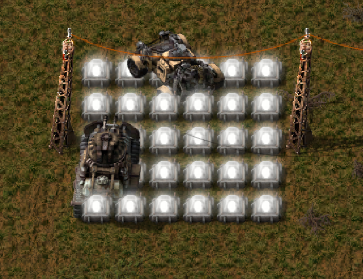

# DDDGamer's Factorio [No Lamp Collision Mod](https://mods.factorio.com/mod/DDD-NO_LAMP_COLLISION) 

Are you annoyed by continually running over your "street" Lamps with your car? Then this Mod is for you! It simply removes the collision between the car and the Lamp!

Forked from:
- https://mods.factorio.com/mod/NoLampCollision/
- https://github.com/Dentur/NoLampCollision

# Installation
1. In Game Install
   * Search for the mod in the `Mods` menu and Factorio will install it and restart automatically
2. Mod Portal/Manual install
   * Download the zipped file `DDD-NO_LAMP_COLLISION_x.x.x.zip`
     * From the [Mod Portal](https://mods.factorio.com/mod/ddd_no-lamp-collision
)
     * OR the [Latest Release](https://github.com/deniszholob/factorio-mod_no-lamp-collision/releases/latest)
   * Place into the 
     * `%appdata%/Factorio/mods/` folder (windows)
     * `~/.factorio/mods/` folder (Linux)
     * See [wiki for more details](https://wiki.factorio.com/Modding#Downloading_.26_installing_mods)

# Support Me
If you find the mod or the source code useful, consider:

* Donating Ko-fi: https://ko-fi.com/deniszholob
* Supporting on Patreon: https://www.patreon.com/deniszholob

# Related
* [Factorio Cheat Sheet](https://factoriocheatsheet.com/)
* [Soft Mod Pack](https://github.com/deniszholob/factorio-softmod-pack) that uses this mod
* [Evolution Indicator Mod](https://github.com/deniszholob/factorio-mod-evolution-indicator)
* [Floating Health Mod](https://github.com/deniszholob/factorio-mod-floating-health)
* [No Lamp Collision Mod](https://github.com/deniszholob/factorio-mod_no-lamp-collision)
* [Player List Mod](https://github.com/deniszholob/factorio-mod-player-list)
